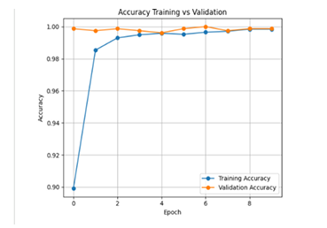
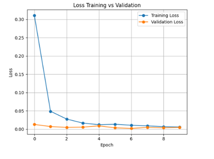
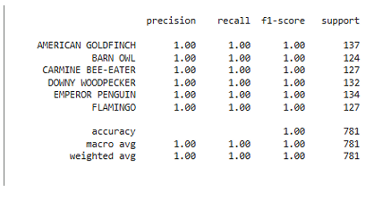
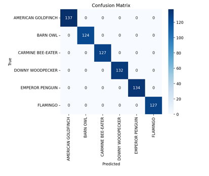
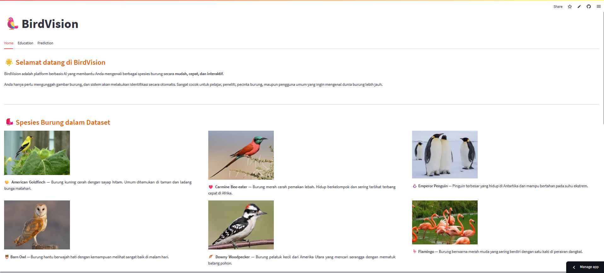
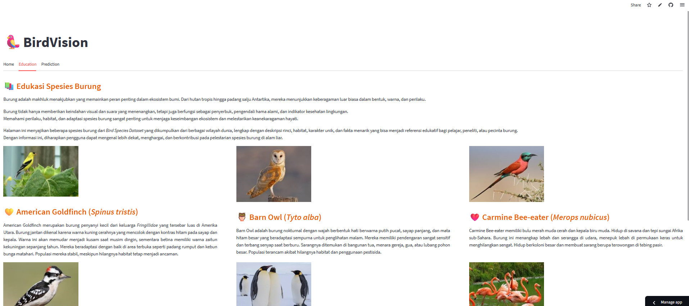
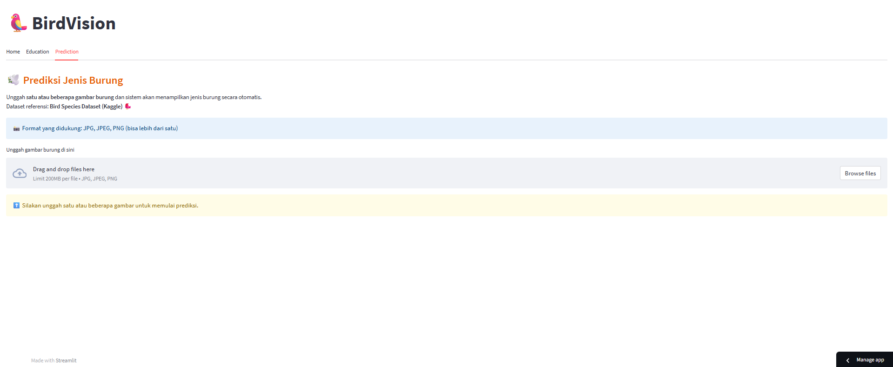
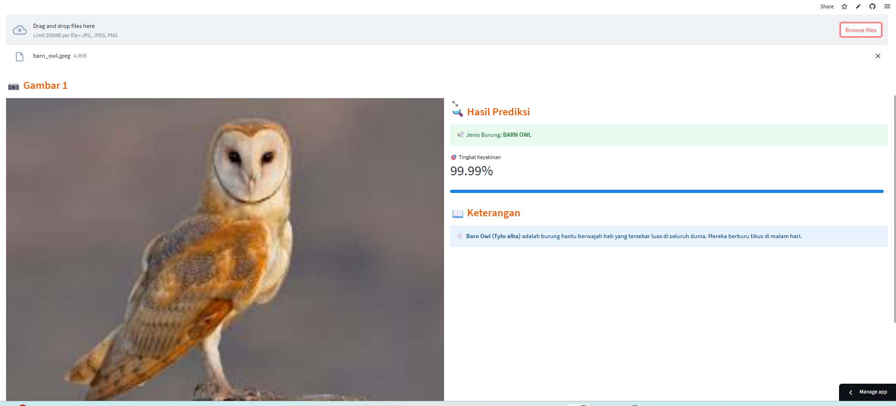

# 🐦 BirdVision App

BirdVision App is a web-based **Computer Vision** application developed using **Python** and **Streamlit** to automatically identify and classify bird species from images. The application utilizes the **MobileNetV2** deep learning architecture through transfer learning to provide fast and accurate bird species classification.

The project supports educational purposes, biodiversity conservation, and introductory research in bird species recognition.

---

## 📖 Overview

Bird species identification plays an important role in biodiversity monitoring, conservation, and wildlife research. However, manual identification requires expertise and can be time-consuming.

BirdVision App provides an interactive web interface where users can upload bird images and receive instant predictions using a trained deep learning model. The system also provides educational information about the supported bird species.

---

## ✨ Features

- Upload bird images for automatic classification
- Predict bird species using a deep learning model
- Display prediction confidence scores
- Educational page introducing supported bird species
- Interactive web interface built with Streamlit
- Support for six bird species classification

---

## 🤖 Deep Learning Algorithm

This project implements **Transfer Learning** using the **MobileNetV2** architecture, which is pre-trained on the ImageNet dataset and fine-tuned for bird species classification.

The classification model recognizes the following six bird species:

- American Goldfinch
- Barn Owl
- Carmine Bee-eater
- Downy Woodpecker
- Emperor Penguin
- Flamingo

MobileNetV2 was selected because it provides a good balance between classification accuracy, computational efficiency, and lightweight deployment for web applications.

---

## 🛠️ Technologies

- Python
- TensorFlow / Keras
- MobileNetV2
- Streamlit
- NumPy
- Matplotlib

---

## 📂 Project Structure

```text
birdvision-app/
│
├── app.py
├── README.md
├── requirements.txt
│
├── assets/
│   ├── home.png
│   ├── education.png
│   ├── prediction.png
│   ├── result.png
│   ├── accuracy_curve.png
│   ├── loss_curve.png
│   ├── metrik_performance.png
│   └── confusion_matrix.png
│
├── model/
├── dataset/
└── ...
```

---

## 📊 Dataset

This project uses the **Bird Species Image Classification** dataset from Kaggle.

**Dataset Source**

https://www.kaggle.com/datasets/rahmasleam/bird-speciees-dataset

Although the original dataset contains many bird species, this project focuses on the following six classes:

- American Goldfinch
- Barn Owl
- Carmine Bee-eater
- Downy Woodpecker
- Emperor Penguin
- Flamingo

The dataset was processed through data preprocessing, model training, and evaluation using the MobileNetV2 architecture.

---

## 📈 Model Evaluation

The MobileNetV2 model was evaluated using several performance metrics to measure its classification capability.

Evaluation metrics include:

- Accuracy
- Precision
- Recall
- F1-Score
- Confusion Matrix

### Accuracy Curve

The accuracy curve illustrates the training and validation accuracy during each training epoch.



---

### Loss Curve

The loss curve shows how the model minimized prediction errors throughout the training process.



---

### Performance Metrics

The overall classification performance is summarized using Accuracy, Precision, Recall, and F1-Score.



---

### Confusion Matrix

The confusion matrix visualizes the prediction results for each bird species, helping identify correctly classified samples and misclassification patterns.



---

## 📸 Application Preview

### Home Page



### Education Page



### Prediction Page



### Classification Result



---

## 🚀 Getting Started

### 1. Clone the repository

```bash
git clone https://github.com/username/birdvision-app.git
cd birdvision-app
```

### 2. Install dependencies

```bash
pip install -r requirements.txt
```

### 3. Run the application

```bash
streamlit run app.py
```

Open your browser and access the local Streamlit URL displayed in the terminal.

---

## 🎯 Project Objective

The objective of this project is to develop a web-based bird species classification system using transfer learning with MobileNetV2. The application aims to assist users in automatically identifying bird species while demonstrating the practical implementation of deep learning and computer vision techniques for image classification.

---

## 📄 License

This project was developed for educational purposes and portfolio demonstration.
